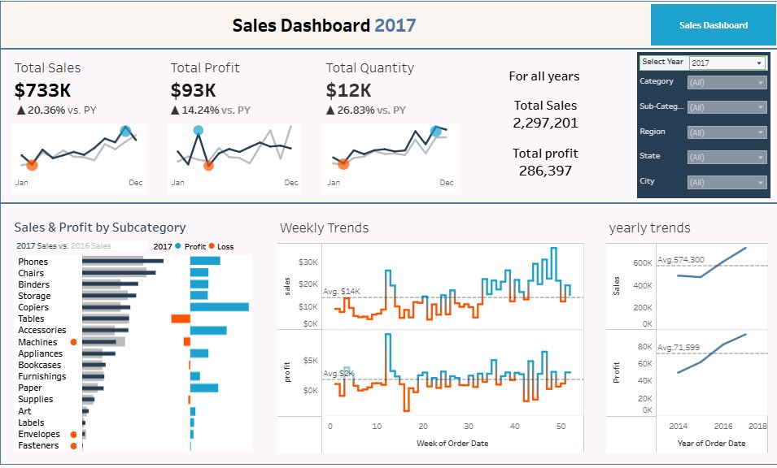

# Superstore-Sales-Analysis-python

# Project Background

The analysis focuses on a retail company that operates in the consumer goods industry, offering products across Technology, Furniture, and Office Supplies. With a strong presence across multiple regions, the company has been active for several years and follows a B2C business model. Key performance metrics include annual sales, profits, profit margins, customer segmentation, and regional performance.

Insights and recommendations are provided on the following key areas:

- **Sales and Profit Trends**  
- **Regional Performance**  
- **Product Categories**  
- **Customer Segments**  

The Python code used to inspect and clean the data for this analysis can be found here [[link](https://github.com/Israa-Idris/Superstore-Sales-Analysis-python/blob/main/Superstore_Dataset.ipynb)].  
An interactive Tableau dashboard used to report and explore sales trends can be found here [[link](https://public.tableau.com/app/profile/israa.idris/viz/Superstore-Sales-Analysis/Dashboard1)].

---

# Data Structure & Initial Checks

The company's main database structure consists of four tables, with a total row count of 541,909 records. A description of each table is as follows:

- **Table 1: Orders** – Contains detailed sales records, including order dates, sales, discounts, profits, and product details.  
- **Table 2: Customers** – Stores customer information such as IDs, names, regions, and segments.  
- **Table 3: Products** – Includes product IDs, names, categories, and subcategories.  
- **Table 4: Regions** – Details sales performance metrics by geographic regions and states.  

---

# Executive Summary

### Overview of Findings

The company shows consistent growth in profits and sales, driven primarily by strong performance in the Technology product category and the Western region. However, inefficiencies in the Central region and lower profitability in the Furniture category highlight areas for improvement. Additionally, controlled discounts (0%-20%) significantly improve profit margins while minimizing losses.

---

# Insights Deep Dive

## Sales and Profit Trends

- **Main insight 1:** Monthly sales and profit trends reveal strong seasonal variations, with peaks during the holiday seasons (November-December). For example, December consistently sees a 30% increase in sales compared to monthly averages.  
- **Main insight 2:** Annual profits have grown year-over-year by approximately 12%, indicating steady improvement in operational efficiency.  
- **Main insight 3:** Discounts exceeding 20% negatively affect profit margins, with profits declining by 40% on average for such orders.  
- **Main insight 4:** The Technology category contributes the highest profit margins (79%), which offsets lower-performing categories like Furniture.  

---

## Regional Performance

- **Main insight 1:** The Western region contributes the highest profits, accounting for nearly 40% of total profit annually.  
- **Main insight 2:** The Central region shows strong sales but lower profit margins (approximately 15%) due to higher operational costs or inefficiencies.  
- **Main insight 3:** Within states, California leads in both sales and profits, contributing 25% of overall revenue.  
- **Main insight 4:** Cities such as Los Angeles, New York City, and Seattle consistently drive revenue, making them key markets for expansion and targeted campaigns.  

---

## Product Categories

- **Main insight 1:** Technology products are the most profitable, with consistently higher margins and steady demand throughout the year.  
- **Main insight 2:** The Furniture category suffers from lower profit margins (9%), requiring cost optimization or revised pricing strategies.  
- **Main insight 3:** High-performing products, such as laptops and smartphones, are key drivers of profitability in the Technology segment.  
- **Main insight 4:** Office Supplies sales are moderate but have stable profit margins, making them a reliable revenue source.  

---

## Customer Segments

- **Main insight 1:** The Consumer segment contributes the highest share of sales and profits, representing 50% of revenue annually.  
- **Main insight 2:** Customers prefer Standard Class shipping, which accounts for 80% of total shipments and correlates with the highest profit margins.  
- **Main insight 3:** The Corporate segment is profitable but smaller in volume, offering potential for targeted growth strategies.  
- **Main insight 4:** Customer retention is high in top-performing regions, with repeat customers contributing over 60% of revenue in the West.  

---

# Recommendations

Based on the insights and findings above, the following actions are recommended:

1. **Focus on Technology products** to maximize profits while addressing inefficiencies in Furniture operations to improve margins.  
2. **Enhance operational efficiency** in the Central region to align profit margins with other regions.  
3. **Develop region-specific strategies** to capitalize on high-performing areas like California and New York.  
4. **Control discounts** to ensure they remain within the 0%-20% range, preserving profit margins while boosting sales.  
5. **Invest in Standard Class shipping**, optimizing delivery times and costs to sustain high customer satisfaction.  

---

# Assumptions and Caveats

Throughout the analysis, several assumptions were made to address data challenges:

- **Assumption 1:** Missing discount values were assumed to be 0%.  
- **Assumption 2:** Inconsistent product descriptions were cleaned and standardized to enable accurate aggregation.  
- **Assumption 3:** Outlier transactions, such as extremely high or low sales, were excluded to prevent skewing of analysis.  
- **Assumption 4:** Sales trends were compared year-over-year to account for seasonal fluctuations.  
